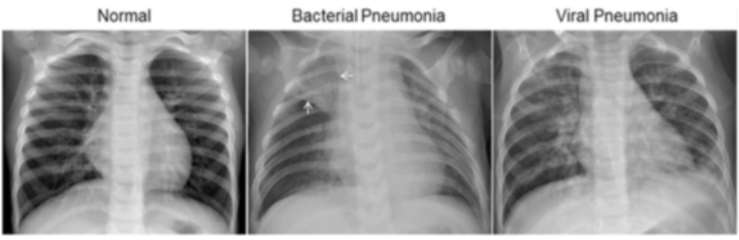

# dsc-phase-4-project

## Project Overview

The goal of this project is to predict the presence of pneumonia in patients from x-rays. The business applications of this project include offering a stand-alone software product that will quickly make diagnostics or a tool that could assist medical practitioners in making diagnoses. With over [1 million people in the US seeking hospital care in the US every year and about 50,000 deaths](https://www.thoracic.org/patients/patient-resources/resources/top-pneumonia-facts.pdf), the potential for this kind of product, aimed at predicting the presence of pneumonia in patients, will represent substantial business and ethical interests if executed well. 

## Navigation Instructions

This project utilizes a Jupyter Notebook for all the code and data exploration used throughout the project. This notebook is referred to as 'index.ipynb'. All data exploration and modeling can be found in this notebook. However, note that the data for this project is not included in this repository because of how large the file is. It can be found on Kaggle, and its location is linked below. This project also includes a 'PDFs' folder that houses the PDFs for the presentation, modeling notebook, etc. Another folder, images, can be navigated to in order to look at any of the images referenced in this project.

## Links to Important Resources

1. [Project Presentation]
2. [Data Exploration and Modeling Notebook](https://github.com/samoliver3/dsc-phase-4-project/blob/main/index.ipynb)
3. [The Dataset](https://www.kaggle.com/datasets/paultimothymooney/chest-xray-pneumonia)

### The Data

The data comes from a Kaggle dataset located [here](https://www.kaggle.com/datasets/paultimothymooney/chest-xray-pneumonia) (same link as above). There are 5,800 total images of x-rays with around 1/3 of them representing healthy lungs and the rest representing lungs with the presence of pneumonia. The images that represent x-rays of patients with pneumonia include both bacterial and pneumonia images. Bacterial pneumonia typically manifests in x-rays as localized areas in one or more lobes of the lung. This description is coined by the term "lobar consolidation" in the medical literature. Viral pneumonia typically represents a buildup of scar tissue in the lungs. An example of how these images look in the dataset can be viewed below. Note that the arrows in the "Bacterial Pneumonia" x-ray point to lobar consolidation. 

## Methods

First, the data was observed and the balance of each category was observed. Then, a deep neural network was created to predict how to classify the images in the training set with the categories being pneumonia or normal (healthy) lungs. 