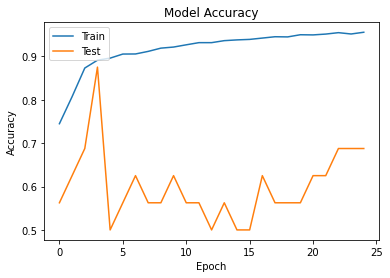
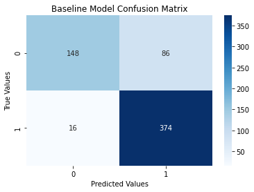

# dsc-phase-4-project

Created by Sam Oliver

## Project Overview

The goal of this project is to predict the presence of pneumonia in patients from x-rays. The business applications of this project include offering a stand-alone software product that will quickly make diagnostics or a tool that could assist medical practitioners in making diagnoses. With over [1 million people in the US seeking hospital care in the US every year and about 50,000 deaths](https://www.thoracic.org/patients/patient-resources/resources/top-pneumonia-facts.pdf), the potential for this kind of product, aimed at predicting the presence of pneumonia in patients, will represent substantial business and ethical interests if executed well. 

## Navigation Instructions

This project utilizes a Jupyter Notebook for all the code and data exploration used throughout the project. This notebook is referred to as 'index.ipynb'. All data exploration and modeling can be found in this notebook. However, note that the data for this project is not included in this repository because of how large the file is. It can be found on Kaggle, and its location is linked below. This project also includes a 'PDFs' folder that houses the PDFs for the presentation, modeling notebook, etc. Another folder, images, can be navigated to in order to look at any of the images referenced in this project.

## Links to Important Resources

1. [Project Presentation](https://github.com/samoliver3/dsc-phase-4-project/blob/main/PDFs/project4Presentation.pdf)
2. [Data Exploration and Modeling Notebook](https://github.com/samoliver3/dsc-phase-4-project/blob/main/index.ipynb)
3. [The Dataset](https://www.kaggle.com/datasets/paultimothymooney/chest-xray-pneumonia)

### The data

The data comes from a Kaggle dataset located [here](https://www.kaggle.com/datasets/paultimothymooney/chest-xray-pneumonia) (same link as above). There are 5,800 total images of x-rays with around 1/3 of them representing healthy lungs and the rest representing lungs with the presence of pneumonia. The images that represent x-rays of patients with pneumonia include both bacterial and pneumonia images. Bacterial pneumonia typically manifests in x-rays as localized areas in one or more lobes of the lung. This description is coined by the term "lobar consolidation" in the medical literature. Viral pneumonia typically represents a buildup of scar tissue in the lungs. An example of how these images look in the dataset can be viewed below. Note that the arrows in the "Bacterial Pneumonia" x-ray point to lobar consolidation. 


### Methods

First, the data was observed and the balance of each category was observed. Then, a convolutional neural network was created to predict how to classify the images in the training set with the categories representing either pneumonia or normal (healthy) lungs. After a baseline model was created, transfer learning (using pre-trained weights) was applied to seek out a more successful predictive model. Specifically, VGG-19 was used in this project. VGG-19 is a CNN that is 19 layers deep, and it can be applied to this project because its architecture is general enough for application to many projects. It's architecture can be seen below:


Dropout regularization was also used in modeling for this project. This technique randomly discards nodes in the neural network, and it is meant to reduce overfitting and improve generalization. This method was important in this project to reduce computatinoal intensity and speed up modeling results. Dropout regularization can be visualized below:


Finally, the best model was then tuned to optimize its performance. 

### Evaluating the success of models

Some common evaluation metrics used in medicine include sensitivity, specificity, and positive predictive value. A good baseline could be comparing model success in these categories to radiology residents. [IBM reports that the sensitivity, specificity, and positive predictive value for radiology residents is as follows: 0.720, 0.973, and 0.682](https://www.ibm.com/blogs/research/2020/11/ai-x-rays-for-radiologists/) respectively. Perhaps another, more conventional method of interpreting results could be an F1 score, which would penalize false negatives and false positives equally. The CheXNet algorithm, developed by Andrew Ng and others at Stanford University, was one of the first major algorithms in machine learning diagnostics to gain traction in this domain. This algorithm also diagnoses pneumonia, and it is reported to have an F1 score of 0.435. This F1 score was better than the average score of 0.387 for radiologis cited in the paper. More information on the specifics of the study and algorithm can be found [here](https://arxiv.org/pdf/1711.05225.pdf). The formulas for all these metrics can be observed below:


In summary, the metrics that will be used for the standards or goals to beat for this project can be summarized in the following table.


### Baseline model

The first model's architecture can be observed below:


The first model received an accuracy of 86.22% when evaluated on the test set. However, its accuracy and loss did not converge from the test to train set. These results can be viewed below:




The evaluation metrics provide some promising results, which will be revisited a little bit later in comparison to the final model results. A rough idea of how these metrics unfold can be previewed with the confusion matrix provided here:



### Final model

The final model utilized transfer learning with the VGG-19 pre-trained weights. This model results in an accuracy of 89.42%. The accuracy and loss of this model on the test set does not necessarily seem to have a particular trend.


An idea for how well this model performed in respect to the metrics in focus for this project can be seen with this model's confusion matrix.


### Overall performance of the models

In comparison to the standards to beat, the baseline and final model both performed better in most respects. The following table shows the results of the models clearly:


The results for the final model are quite good in comparison to the standards with the exception of having about a 4% lower specificity score than the initial goal. Overall, these results are promising and it poses an exciting potential to improve upon.

### Conclusions and further recommendations

Ideas on how to improve the model and achieve business solutions can be summarized by the following points:
1. Collect more data to train the model and standardize this data (i.e. image size)
2. Tune the model and increase computing power to speed up model results.
3. Partner with hospitals and medical practitioners to utilize more (standardized) data and assist with diagnostic abilities.
4. Create diagnostic software that will predict presence of pneumonia in real-time.

## Repository Structure

```
├── PDFs
├── images
├── README.md
└── index.ipynb                          
```